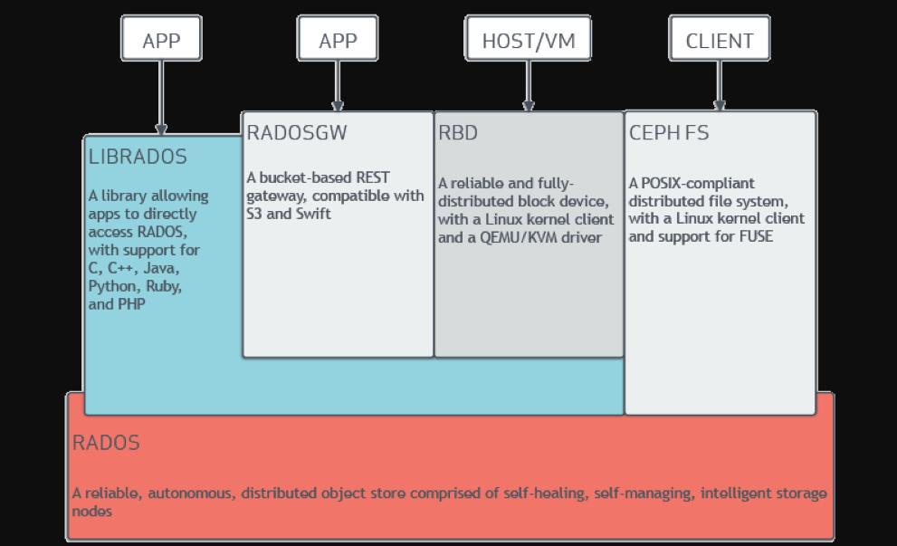
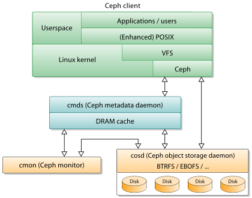

- [ceph简介](#ceph简介)
- [基础架构](#基础架构)
- [ceph文件系统](#ceph文件系统)
  - [1.内核空间挂载](#1内核空间挂载)
  - [2.用户空间文件系统挂载](#2用户空间文件系统挂载)
- [ceph块设备](#ceph块设备)
- [ceph对象网关](#ceph对象网关)
- [关于fuse](#关于fuse)
- [参考资料](#参考资料)

## ceph简介
ceph是一种软件定义存储的分布式文件存储解决方案，支持ceph文件系统、块存储、对象存储三种方式，是当前主流的分布式存储系统之一。

Ceph是加州大学Santa Cruz分校的Sage Weil（ DreamHost的联合创始人） 专为博士论文设计的新一代自由软件分布式文件系统。

2004年， Ceph项目开始， 提交了第一行代码。

2006年， OSDI学术会议上， Sage发表了介绍Ceph的论文， 并在该篇论文的末尾提供了Ceph项目的下载链接。

2010年， Linus Torvalds将CephClient合并到内核2.6.34中， 使Linux与Ceph磨合度更高。

2012年， 拥抱OpenStack， 进入Cinder项目， 成为重要的存储驱动。

2014年， Ceph正赶上OpenStack大热， 吸引来自不同厂商越来越多的开发者加入， Intel、 SanDisk等公司都参与其中， 同时Inktank公司被Red Hat公司1.75亿美元收购。

2015年， Red Hat宣布成立Ceph顾问委员会， 成员包括Canonical、 CERN、 Cisco、 Fujitsu、Intel、 SanDisk和SUSE。 Ceph顾问委员会将负责Ceph软件定义存储项目的广泛议题， 目标是使Ceph成为云存储系统。

ceph FS 可以作为Hadoop后端数据存储池，可代替HDFS的存储方案。

Ceph与KVM虚拟化结合，ceph块存储RBD可作为KVM虚拟化的后端存储。

ceph块存储RBD可作为openstack的后端存储。

Ceph的RGW与OwnCloud搭配，搭建本地网盘。

## 基础架构
基础架构：

客户端-集群架构：

* mds：存储元数据（也就是说，Ceph 块设备和 Ceph 对象存储不使用MDS ）。元数据服务器使得 POSIX 文件系统的用户们，可以在不对 Ceph 存储集群造成负担的前提下，执行诸如 ls、find 等基本命令。
* osd：功能是存储数据，处理数据的复制、恢复、回填、再均衡，并通过检查其他OSD 守护进程的心跳来向 Ceph Monitors 提供一些监控信息。
* monitor：维护着展示集群状态的各种图表，包括监视器图、 OSD 图、归置组（ PG ）图、和 CRUSH 图。
  
* rgw：提供兼容S3和Swift的对象存储接口。
* mgr：执行集群监视，簿记和维护任务，并与外部监视系统和管理（例如平衡器，仪表板，Prometheus和Zabbix插件）接口的管理器。

Ceph 把客户端数据保存为存储池内的对象。通过使用 CRUSH 算法， Ceph 可以计算出哪个归置组（PG）应该持有指定的对象(Object)，然后进一步计算出哪个 OSD 守护进程持有该归置组。 CRUSH 算法使得 Ceph 存储集群能够动态地伸缩、再均衡和修复。

## ceph文件系统
ceph支持创建和挂载CephFS文件系统，也同时支持两种空间的挂载：

### 1.内核空间挂载
  
**注意：** ceph fs new 命令是从 Ceph 0.84 起引入的，在此之前，无需手动创建文件系统，名为 data 和 metadata 的存储池默认即存在。
Ceph 命令行现在有了创建和删除文件系统的命令，但是当前一套集群只能有一个文件系统存在。

### 2.用户空间文件系统挂载
通过ceph-fuse挂载为fuse(Filesystem in Userspace)。

## ceph块设备
块是一个字节序列（例如，一个 512 字节的数据块）。基于块的存储接口是最常见的存储数据方法，它们基于旋转介质，像硬盘、 CD 、软盘、甚至传统的 9 磁道磁带。无处不在的块设备接口使虚拟块设备成为与 Ceph 这样的海量存储系统交互的理想之选。

Ceph 块设备是精简配置的、大小可调且将数据条带化存储到集群内的多个 OSD 。 Ceph 块设备利用 RADOS 的多种能力，如快照、复制和一致性。 Ceph 的 RADOS 块设备（ RBD ）使用内核模块或 librbd 库与 OSD 交互。

## ceph对象网关
Ceph 对象网关是一个构建在 librados 之上的对象存储接口，它为应用程序访问Ceph 存储集群提供了一个 RESTful 风格的网关 。 Ceph 对象存储支持 2 种接口：

兼容S3: 提供了对象存储接口，兼容 亚马逊S3 RESTful 接口的一个大子集。

兼容Swift: 提供了对象存储接口，兼容 Openstack Swift 接口的一个大子集。

Ceph 对象存储使用 Ceph 对象网关守护进程（ radosgw ），它是个与 Ceph 存储集群交互的 FastCGI 模块。因为它提供了与 OpenStack Swift 和 Amazon S3 兼容的接口， RADOS 要有它自己的用户管理。 Ceph 对象网关可与 Ceph FS 客户端或 Ceph 块设备客户端共用一个存储集群。 S3 和 Swift 接口共用一个通用命名空间，所以你可以用一个接口写如数据、然后用另一个接口取出数据。

## 关于fuse
用户空间文件系统（Filesystem in Userspace，简称FUSE）是一个面向类Unix计算机操作系统的软件接口，它使无特权的用户能够无需编辑内核代码而创建自己的文件系统。目前Linux通过内核模块对此进行支持。一些文件系统如ZFS、glusterfs和lustre使用FUSE实现。

Linux从2.6.14版本开始通过FUSE模块支持在用户空间实现文件系统。

在用户空间实现文件系统能够大幅提高生产率，简化了为操作系统提供新的文件系统的工作量，特别适用于各种虚拟文件系统和网络文件系统。

但是，在用户态实现文件系统必然会引入额外的内核态/用户态切换带来的开销，对性能会产生一定影响。

比较知名的用户空间文件系统

ExpanDrive：商业文件系统，实现了SFTP/FTP/FTPS协议；

GlusterFS：用于集群的分布式文件系统，可以扩展到PB级；

SSHFS：通过SSH协议访问远程文件系统；

GmailFS：通过文件系统方式访问GMail；

EncFS：加密的虚拟文件系统

NTFS-3G和Captive NTFS，在非Windows中对NTFS文件系统提供支持；

WikipediaFS：支持通过文件系统接口访问Wikipedia上的文章；

升阳公司的Lustre：和GlusterFS类似但更早的一个集群文件系统

ZFS：Lustre的Linux版；

archivemount：

HDFS: Hadoop提供的分布式文件系统。HDFS可以通过一系列命令访问，并不一定经过Linux FUSE；

note: 区别于ceph-fuse，也可以自己基于rgw实现一个fuse。

## 参考资料
【1】https://en.wikipedia.org/wiki/Ceph_(software)

【2】https://zh.wikipedia.org/wiki/FUSE

【3】http://docs.ceph.org.cn/start/intro/